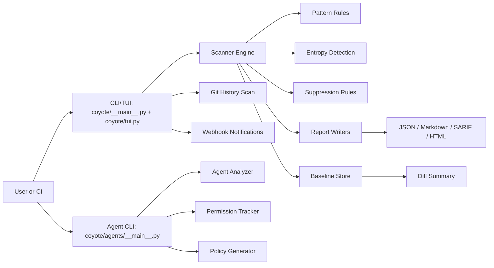

# Coyote Architecture Overview

A technical, shareable overview of the Coyote repository and agent security scanner, based on a codebase review. This document is designed to gather feedback on structure, flows, and extensibility.

## Executive Summary
Coyote is a dual-purpose security tool that scans repositories for secrets and security smells, and analyzes AI agent configurations for risky capabilities. The repo contains a primary `coyote` package with a Rich-based TUI and CLI, a scanning engine with pattern and entropy detection, reporting in multiple formats, baseline diffing, git history scanning, and webhook notifications. Agent analysis lives under `coyote/agents/` and parallels a legacy or standalone `moltsec/` package with similar functionality.

## Goals
1. Detect secrets, credentials, and security anti-patterns in code and history.
2. Provide actionable reports in multiple formats for CI and humans.
3. Track findings over time via stable IDs and baselines.
4. Analyze AI agents for risky permissions and generate runtime policies.
5. Offer a usable CLI and TUI for local workflows and watchers.

## Non-Goals
1. Full static analysis of complex code semantics.
2. Live runtime sandboxing of arbitrary repositories.
3. Remediation or automated secret rotation.

## System Context
Coyote is run locally or in CI/CD. It consumes a repo path or a GitHub URL (via `coyote.sh` watcher). Outputs are reports and optional webhook notifications. Agent analysis consumes agent config files and produces manifests, diffs, and policies.

## Architecture Diagram

## Core Flows

### Repository Scan
1. `coyote/tui.py` parses arguments and loads config.
2. `coyote/scanner.py` collects files, filters exclusions, and checks size.
3. `coyote/patterns.py` applies secret and smell regex rules.
4. `coyote/entropy.py` optionally scans for high-entropy candidate strings.
5. `coyote/suppress.py` filters findings using `.coyote-ignore`.
6. Results are displayed in TUI or saved via `coyote/reporter.py`.

### Baseline Diff
1. A scan is saved by `coyote/baseline.py` as `.coyote-baseline.json`.
2. A new scan compares finding IDs to categorize new, fixed, and existing.
3. `coyote/tui.py` renders a diff panel and can fail CI via `--fail-on-new`.

### Git History Scan
1. `coyote/history.py` runs `git log -p` and parses added lines.
2. Secret patterns are matched only against additions for each commit.
3. Findings are grouped by commit with metadata for reporting.

### Agent Analysis
1. `coyote/agents/__main__.py` loads an agent config file.
2. Analyzer creates a capability manifest and risk summary.
3. Tracker stores versions and computes diffs.
4. Policy generator emits runtime policy JSON with strictness modes.

## Key Modules and Responsibilities

| Module | Responsibility |
|---|---|
| `coyote/__main__.py` | CLI entry and command routing |
| `coyote/tui.py` | Rich-based UI, CLI args, scan orchestration |
| `coyote/scanner.py` | File collection and pattern application |
| `coyote/patterns.py` | Secret and smell rules, sensitive filenames |
| `coyote/entropy.py` | Entropy-based secret detection |
| `coyote/suppress.py` | `.coyote-ignore` parsing and filtering |
| `coyote/reporter.py` | JSON/Markdown/SARIF/HTML reports |
| `coyote/baseline.py` | Baseline save/load and diffing |
| `coyote/history.py` | Git history scanning |
| `coyote/notifications.py` | Slack/Discord notifications |
| `coyote/agents/*` | Agent analysis, diffing, policy |
| `moltsec/*` | Standalone agent analysis package |

## Data Model Overview

### Finding
- `finding_id` is a stable hash of rule, file, line, and match value.
- Enables diffing across scans and suppression by ID.

### Baseline
- JSON file storing findings and metadata.
- Diff uses set comparisons on `finding_id`.

### Agent Manifest
- Structured model with capabilities, risks, metadata, and summary.
- Used for diffing and policy generation.

## Configuration
- `config.yaml` overrides defaults in `coyote/config.py`.
- `config.example.yaml` provides a template for repo/branch, exclusions, outputs, and webhooks.

## Extensibility
1. Add rules to `coyote/patterns.py` for new secret/smell types.
2. Add new output formats in `coyote/reporter.py`.
3. Extend agent capability detection in `coyote/agents/analyzer.py`.
4. Add new notification channels in `coyote/notifications.py`.

## Strengths
1. Clear separation of detection, suppression, diffing, and reporting.
2. Stable finding IDs enable reliable baselines and suppression.
3. Multi-format outputs make CI and human review easy.
4. Agent security analysis is integrated yet separable.

## Risks and Opportunities
1. Pattern-based detection may yield false positives and misses.
2. History scanning parses diffs only and may miss context.
3. Two agent analysis packages could create drift or duplication.
4. Regex rules are centralized and can become a bottleneck for performance.

## Open Questions
1. Should `moltsec/` be deprecated or promoted as a standalone package?
2. Should `coyote/agents/` and `moltsec/` share a common core?
3. Do we want configurable rule packs by ecosystem or language?
4. Should entropy detection integrate context heuristics to reduce noise?

---

If you want a version tailored for a pitch deck or a shorter one-pager, I can create that too.
